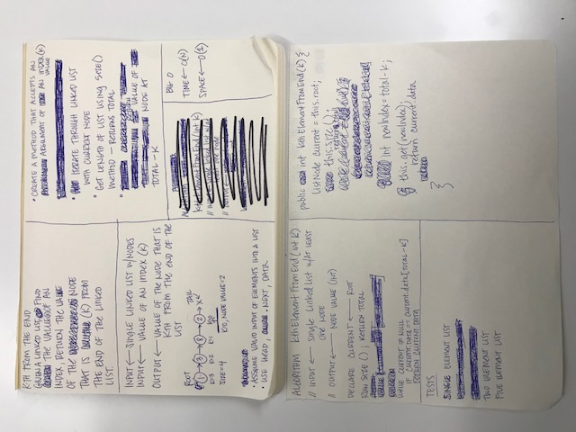

# k-th Value
Find the k-th value from the end of a linked list.

## Challenge
Write a method for the Linked List class which takes a number (k) as a parameter. Return the node that is (k) from the
end of the linked list.

Write at least three test assertions for each method that you define.

Example:

Input
```
head -> [1] -> [3] -> [8] -> [2] -> x
```
Output
Arguments: 0
```
[2] ->
```

## Solution
