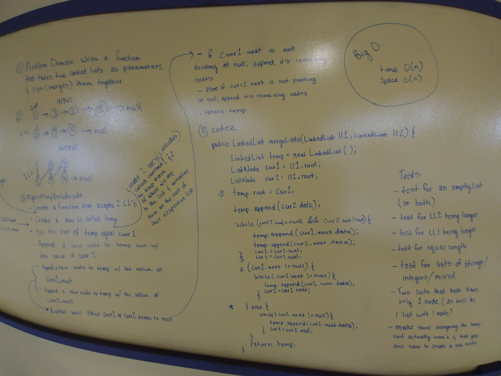

# Merge two Linked Lists
Find the k-th value from the end of a linked list.

## Challenge
Write a function called mergeLists which takes two linked lists as arguments. Zip the two linked lists together into one
 so that the nodes alternate between the two lists and return a reference to the head of the single list. Try and keep additional space down to O(1).

Write at least three test assertions for each method that you define.

Example:

Input
```
head -> [1] -> [3] -> [2] -> x
head -> [5] -> [9] -> [4] -> x
```
Output
```
[1] -> [5] -> [3] -> [9] -> [2] -> [4] -> x
```

## Solution


## Contributors
Tara Johnson
Brandon Fenty