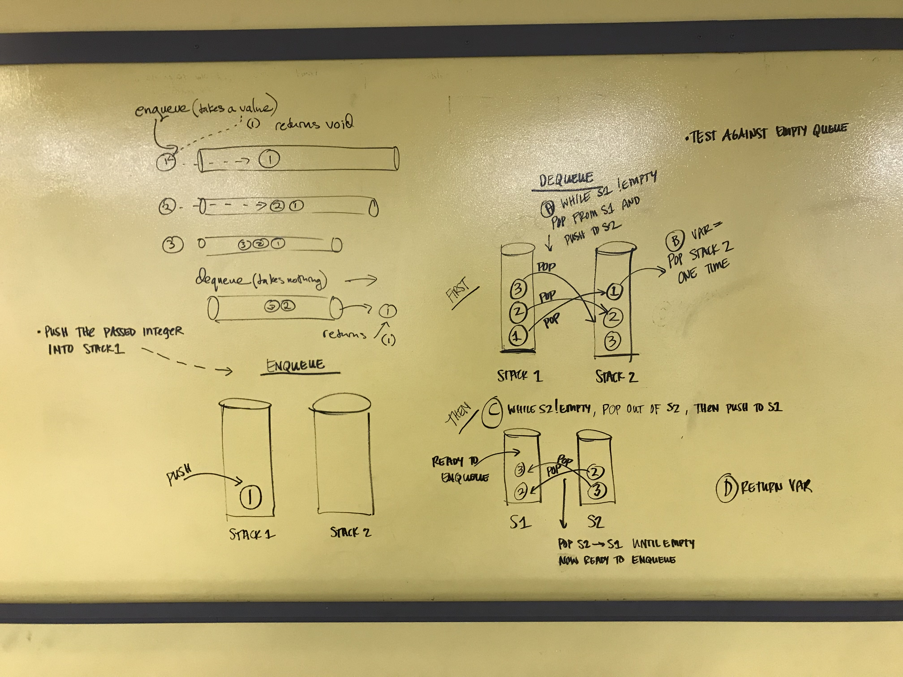

#Implement a Queue using two Stacks

## Challenge
Implement the enqueue(value) and dequeue() methods for the Queue class.
- enqueue(value) - inserts (value) into the Queue using a first-in, first-out approach
- dequeue - extracts a value from the Queue using a first-in, first-out approach

Write at least three test assertions for each method that you define.

Example:

enqueue(value)
Input
```
[10] -> [15] -> [20]
```
Output
Arguments: 5
```
[5] -> [10] -> [15] -> [20]
```

enqueue(value)
Input
```
[5] -> [10] -> [15] -> [20]
```
Output
Arguments: 5
```
[5] -> [10] -> [15]
```

## Solution


## Contributors
Tara Johnson
Molly Kent