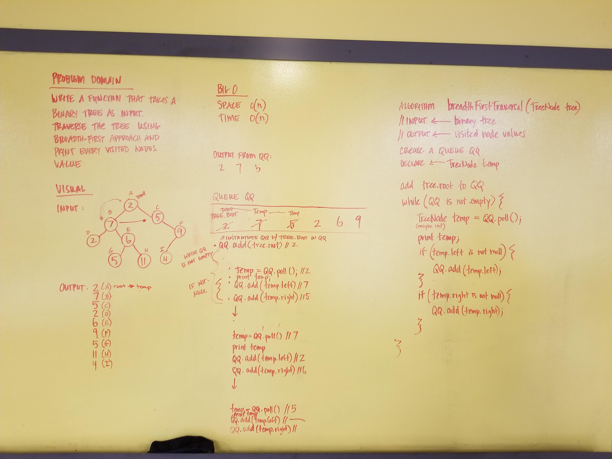

#Breadth-first Traversal

## Challenge
Write a function which takes a Binary Tree as its unique input. Traverse the input tree using a Breadth-first approach and print every node's values.

Example:

Input
```
             2
    7               5
2       6               9
    5       11      4
```

Output
```
2
7
5
2
6
9
5
11
4
```

## Solution


##Contributors
Nick DiPietro  
Tara Johnson