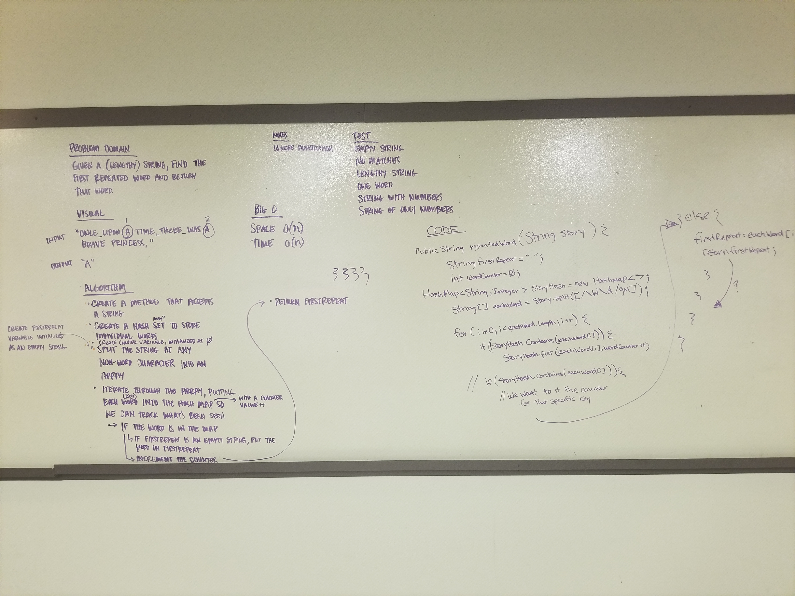

# First Repeated Word
Find the first repeated word in a book.

## Challenge
Write a function that accepts a lengthy string parameter. Return the first word to occur more than once in that provided string.

Write at least three test assertions for each method that you define.

Example:

Input  
```
"Once upon a time, there was a brave princess who..."

"It was a queer, sultry summer, the summer they electrocuted the Rosenbergs, and I didn’t know what I was doing in New York..."
```

Output
```
"a"

"summer"
```

## Solution
